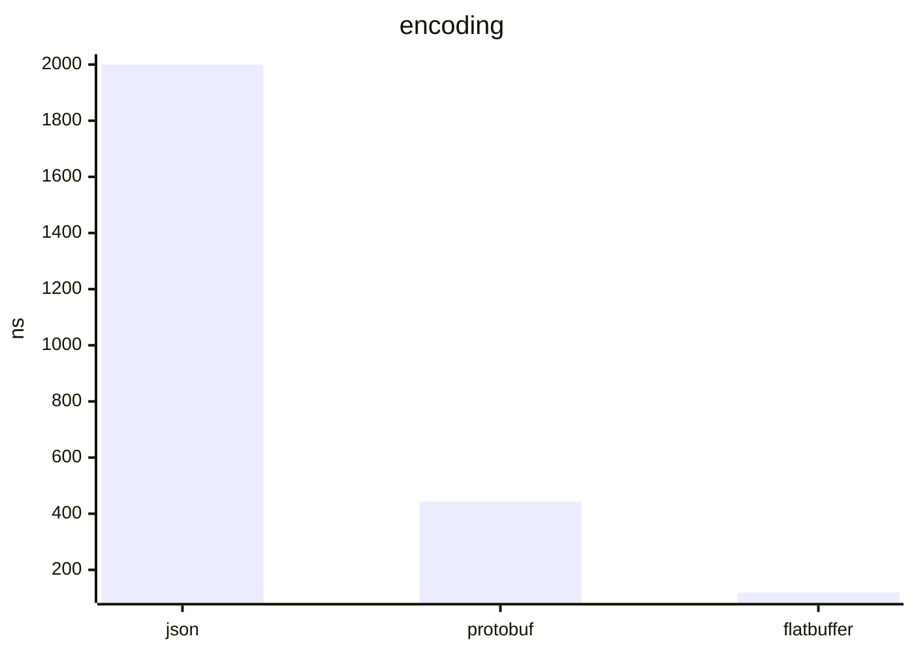
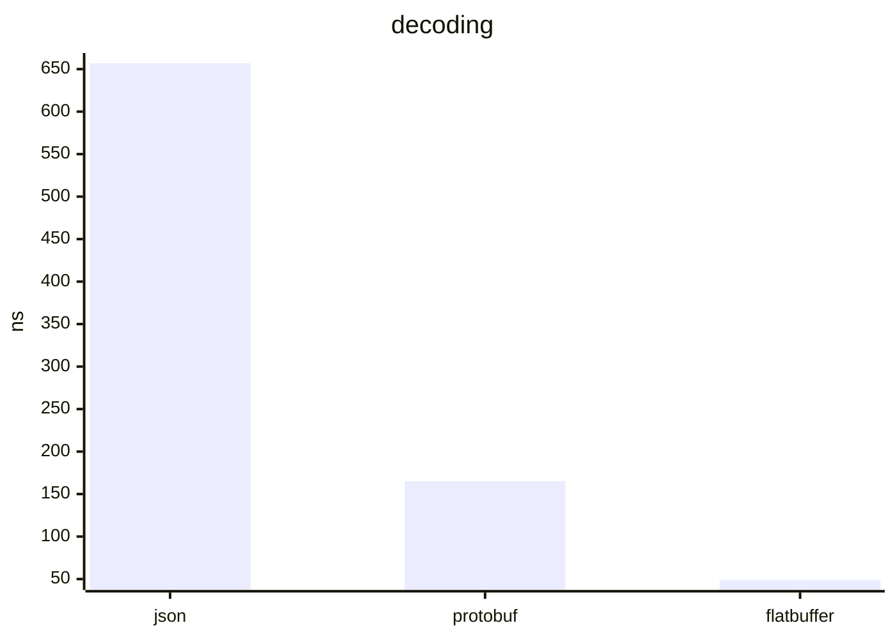
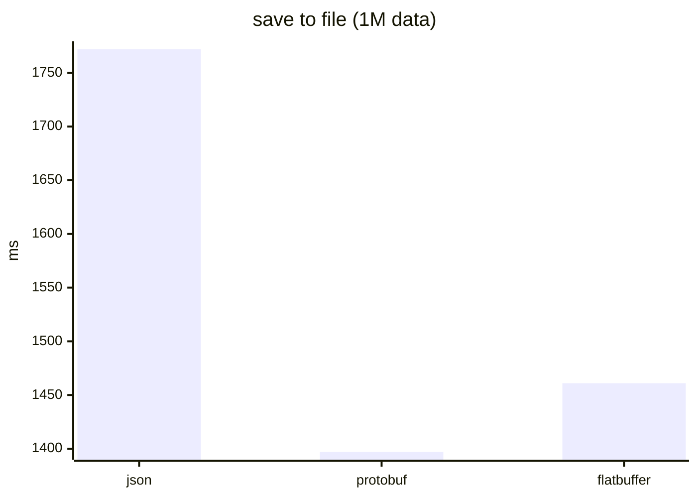

# JsonBenchmark

<a alt="Nx logo" href="https://nx.dev" target="_blank" rel="noreferrer"></a>

✨ Your new, shiny [Nx workspace](https://nx.dev) is ready ✨.

[Learn more about this workspace setup and its capabilities](https://nx.dev/nx-api/node?utm_source=nx_project&amp;utm_medium=readme&amp;utm_campaign=nx_projects) or run `npx nx graph` to visually explore what was created. Now, let's get you up to speed!

## Quick Start

```sh
make install
make bench
```

<br>

## Result
```
Platform info:
==============
Darwin 23.5.0 arm64
Node.JS: 20.11.1
V8: 11.3.244.8-node.17
CPU: Apple M1 Max × 10
Memory: 64 GB
```







<br>

|            | encoding | decoding | save to file (1M data) | file size (1M data) | Difficulty      |
|------------|----------|----------|------------------------|---------------------|-----------------|
| json       | 2000ns   | 675ns    | 1.7 sec                | 151MB               | Easy            |
| protobuf   | 443ns    | 165ns    | 1.4 sec                | 26MB                | Medium          |
| flatbuffer | 119ns    | 49ns     | 1.4 sec                | 211MB               | Hard<sup>*</sub>|

<sup>*</sup> flatbuffer 는 schema 변경하기가 어렵다
- 새로운 field 는 무조건 제일 아래에 넣어야한다
- field 가 한번 정해지면 삭제 불가
- array 를 지원하는건 struct 에서만 가능
  - 여기에 한번 정의되면 변경 불가
  - 여기에는 primitive type 밖에 못들어감

<br>

## Development

To generate a new application, use:

```sh
npx nx g @nx/node:app demo
```

To generate a new library, use:

```sh
npx nx g @nx/node:lib libs/mylib
```

### Note
- js 파일로 된 프로젝트를 가져올 수 있는 방법이 없어서, `libs/data-*` 폴더는 `package.json` 에서 상대 경로로 참조하고 있습니다.
- 이때, `nx graph` 로 dependency 를 확인하면 제대로 표시되지 않습니다.
- 따라서, 실행할때 `Makefile`을 통해서 실행하는것이 좋습니다
